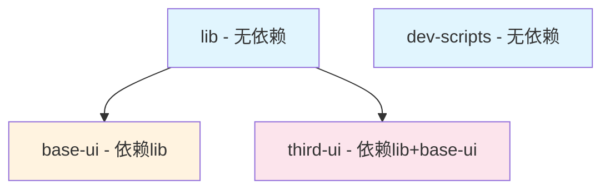

# Windrun Huaiin Monorepo

🚀 基于 Next.js + TypeScript + TailwindCSS 的现代化文档网站和应用系统 Monorepo 项目。

## 📁 工程结构

```
windrun-huaiin/
├── apps/                          # 应用目录
│   ├── ddaas/                     # 主文档网站应用 (DDAAS)
│   └── formato/                   # 另一个应用
├── packages/                      # 共享包目录
│   ├── base-ui/                   # 基础 UI 组件库
│   ├── third-ui/                  # 第三方集成 UI 组件
│   ├── lib/                       # 通用工具库
│   ├── dev-scripts/               # 开发脚本工具
│   └── shared-assets/             # 共享静态资源
├── docs/                          # 项目文档
├── scripts/                       # 根目录脚本
└── patches/                       # 第三方包补丁文件
```

### 应用详情

- **`apps/ddaas`**: 基于 Next.js 的文档网站，支持国际化、身份认证、MDX 文档系统
- **`apps/formato`**: 另一个独立应用

### 共享包详情

- **`packages/base-ui`**: 基础 UI 组件，基于 Radix UI + TailwindCSS
- **`packages/third-ui`**: Clerk、Fumadocs 等第三方服务的集成组件
- **`packages/lib`**: 通用工具函数、配置管理、LLM 工具等
- **`packages/dev-scripts`**: 开发时用到的脚本工具（多语言检查、博客索引生成等）
- **`packages/shared-assets`**: 跨应用共享的静态资源（图片、图标等）

## 🛠 技术栈

### 核心技术
- **前端框架**: Next.js 15.3.2 + React 19.1.0
- **语言**: TypeScript 5.8.3
- **样式**: TailwindCSS 4.1.7 + TailwindCSS Typography
- **构建工具**: Turbo 2.5.3 (Monorepo 构建系统)
- **包管理**: pnpm 10.12.1 (workspace)

### 关键依赖
- **UI 组件**: Radix UI (完整组件集)
- **文档系统**: Fumadocs 15.3.3 (MDX 文档生成)
- **身份认证**: Clerk 6.19.4 (用户管理和认证)
- **国际化**: next-intl 3.26.5
- **主题**: next-themes 0.4.6
- **表单**: react-hook-form 7.56.3 + zod 3.24.4
- **数学公式**: KaTeX 0.16.22
- **图表**: Mermaid 11.6.0
- **代码高亮**: Shiki 3.4.2

## ⚙️ 核心配置说明

### Turbo 配置 (`turbo.json`)

Turbo 负责 Monorepo 的任务编排和缓存管理：

```json
{
  "globalEnv": [
    "NODE_ENV",
    "TURBO_TELEMETRY_DISABLED", 
    "TURBO_TOKEN",
    "TURBO_TEAM"
  ],
  "tasks": {
    "copy-shared-assets": {
      "cache": true,
      "inputs": ["packages/shared-assets/public/**", "packages/shared-assets/scripts/**"],
      "outputs": ["../../apps/*/public/shared/**"],
      "env": ["NODE_ENV"]
    },
    "build": {
      "dependsOn": ["^build", "@windrun-huaiin/shared-assets#copy-shared-assets"],
      "outputs": [".next/**", "!.next/cache/**", "dist/**"],
      "env": ["NODE_ENV", "NEXT_PUBLIC_*", "CLERK_SECRET_KEY", "CLERK_DEBUG"]
    },
    "dev": {
      "dependsOn": ["copy-shared-assets"],
      "cache": false,
      "persistent": true,
      "env": ["NODE_ENV", "NEXT_PUBLIC_*", "CLERK_SECRET_KEY", "CLERK_DEBUG"]
    }
  }
}
```

**关键任务说明**:
- `copy-shared-assets`: 复制共享资源到各应用的 public 目录
- `build`: 构建任务，依赖共享资源复制完成
- `dev`: 开发模式，依赖共享资源复制，不缓存且持续运行

**环境变量配置**:
- `globalEnv`: 全局环境变量，对所有任务可用（如 Turbo 配置变量）
- `env`: 任务特定环境变量，声明该任务需要的环境变量
- 所有 Vercel 部署时的环境变量都必须在 `turbo.json` 中声明

### TypeScript 配置

#### 根配置 (`tsconfig.base.json`)
基础 TypeScript 配置，所有子项目继承此配置：

```json
{
  "compilerOptions": {
    "lib": ["dom", "dom.iterable", "esnext"],
    "target": "ES6",
    "strict": true,
    "module": "esnext",
    "moduleResolution": "bundler",
    "jsx": "preserve"
  }
}
```

#### DDAAS 应用配置 (`apps/ddaas/tsconfig.json`)
扩展基础配置，添加路径映射：

```json
{
  "compilerOptions": {
    "baseUrl": ".",
    "paths": {
      "@/*": ["./src/*"],
      ".source/*": ["./.source/*"],
      "@third-ui/*": ["../../packages/third-ui/src/*"],
      "@base-ui/*": ["../../packages/base-ui/src/*"],
      "@lib/*": ["../../packages/lib/src/*"]
    }
  }
}
```

### PNPM Workspace 配置

使用 catalog 管理依赖版本，确保整个 Monorepo 的依赖一致性：

```yaml
packages:
  - packages/*
  - apps/ddaas

catalog:
  react: 19.1.0
  next: 15.3.2
  typescript: ^5.8.3
  # ... 其他共享依赖
```

## 🚀 脚本命令说明

### 根目录命令 (`package.json`)

| 命令 | 描述 | 用途 |
|------|------|------|
| `pnpm build` | 构建所有应用和包 | 生产环境构建 |
| `pnpm build:nocache` | 强制复制共享资源 | 解决资源同步问题 |
| `pnpm dev` | 启动所有应用开发模式 | 并行开发多个应用 |
| `pnpm start` | 启动所有应用生产模式 | 生产环境运行 |
| `pnpm lint` | 代码检查 | 代码质量保证 |
| `pnpm clean` | 清理构建产物 | 清理各包的构建产物 |
| `pnpm deep-clean` / `pnpm d8` | 深度清理项目 | 清理所有 node_modules、.next、dist 等 |
| `pnpm copy-shared-assets` | 复制共享资源 | 手动同步共享资源 |

### 应用特定命令

| 命令 | 描述 | 用途 |
|------|------|------|
| `pnpm ddaas:dev` | 只启动 DDAAS 应用开发 | 单应用开发 |
| `pnpm ddaas:build` | 只构建 DDAAS 应用 | 单应用构建 |
| `pnpm ddaas:start` | 只启动 DDAAS 应用生产模式 | 单应用生产运行 |

### DDAAS 应用命令 (`apps/ddaas/package.json`)

| 命令 | 描述 | 用途 |
|------|------|------|
| `pnpm generate-blog-index` | 生成博客索引 | 自动生成博客文章索引 |
| `pnpm check-translations` | 检查翻译完整性 | 国际化翻译质量检查 |
| `pnpm clean-translations` | 清理无用翻译 | 删除未使用的翻译条目 |
| `pnpm remove-translations` | 强制删除翻译 | 批量删除翻译条目 |

### 深度清理脚本详解

`scripts/deep-clean.js` 是一个安全的深度清理脚本：

**清理目标**:
- 所有 `node_modules` 目录
- Next.js 缓存 (`.next`)
- 构建产物 (`dist`)
- Turbo 缓存 (`.turbo`)

**安全特性**:
- 生产环境保护（`NODE_ENV=production` 时禁止运行）
- 多重删除尝试和验证
- 详细的操作日志

## 🔄 Changeset 变更管理

项目使用 `@changesets/cli` 管理版本和变更记录。

### 基本流程
- 根目录下执行

0. **初始化(首次执行)**:
   ```bash
   pnpm changeset init
   ```
   - 执行后会在根目录下生成`./changeset`文件夹，内含相关配置文件，无需更改

1. **创建变更记录(首次执行)**:
- 将变更内容写入`xxx.md`(**只支持md格式!**)文件放到`./changeset`下
- 变更内容格式参考`docs/changeset-template.mdx`

2. **预览变更**:
   ```bash
   pnpm changeset status
   ```

3. **应用变更** (通常在 CI 中执行):
   ```bash
   pnpm changeset version
   ```

### 变更类型

- `major`: 破坏性变更: 主版本号+1
- `minor`: 新功能添加: 次版本号+1
- `patch`: 问题修复    :  小版本号+1

### 变更记录模板

参考 `docs/changeset-template.mdx` 了解完整的变更记录格式，包含：

- 功能新增 (🚀 New Features)
- 改进优化 (🔧 Improvements)
- 问题修复 (🐛 Bug Fixes)
- 破坏性变更 (💥 Breaking Changes)
- 技术改进 (🧪 Technical Improvements)

## 📚 快速上手

### 环境要求

- Node.js >= 18
- pnpm >= 8

### 初始化项目

```bash
# 1. 安装依赖
pnpm install

# 2. 复制共享资源
pnpm copy-shared-assets

# 3. 启动开发环境
pnpm dev
```

### 单应用开发

```bash
# 只开发 DDAAS 应用
pnpm ddaas:dev
```

### 生产构建

```bash
# 构建所有应用
pnpm build

# 启动生产环境
pnpm start
```

### 项目清理

```bash
# 普通清理（清理构建产物）
pnpm clean

# 深度清理（清理所有 node_modules 和缓存）
pnpm deep-clean

# 清理后重新安装
pnpm install
```

### 开发工具使用

```bash
# 生成博客索引
pnpm --filter=@windrun-huaiin/ddaas-website generate-blog-index

# 检查翻译完整性
pnpm --filter=@windrun-huaiin/ddaas-website check-translations

# 清理无用翻译
pnpm --filter=@windrun-huaiin/ddaas-website clean-translations
```

## 🔧 开发注意事项

1. **共享资源**: 修改 `packages/shared-assets` 后需要运行 `pnpm copy-shared-assets`
2. **依赖管理**: 新增依赖时优先考虑添加到 `catalog` 中
3. **类型安全**: 充分利用 TypeScript 路径映射，避免相对路径引用
4. **构建顺序**: Turbo 会自动处理构建依赖，无需手动管理
5. **多语言**: 使用 dev-scripts 工具管理翻译文件
6. **环境变量**: 
   - 新增环境变量时必须在 `turbo.json` 的相应任务中声明
   - Vercel 部署的环境变量需要在 `turbo.json` 中配置才能生效
   - 使用 `NEXT_PUBLIC_*` 模式声明客户端环境变量

## 🧪 调试和测试工具

### `--dry-run` 参数

`--dry-run` 是一个**预演模式**参数，用于模拟执行而不实际运行命令：

**作用**:
- ✅ **显示执行计划**: 查看将要执行的任务和依赖关系
- ✅ **验证配置**: 确认 `turbo.json` 配置是否正确
- ✅ **检查环境变量**: 查看任务所需的环境变量配置
- ❌ **不实际执行**: 不会真正运行构建或其他命令

**使用示例**:

```bash
# 查看构建执行计划
pnpm build --dry-run

# 查看生产构建执行计划
pnpm build:prod --dry-run

# 查看单应用构建计划
pnpm ddaas:build --dry-run

# 查看指定任务执行计划
turbo run build --filter=@windrun-huaiin/ddaas-website --dry-run
```

**输出信息包含**:
- 📦 **任务列表**: 将要执行的所有任务
- 🔗 **依赖关系**: 任务之间的依赖顺序
- 📁 **输出目录**: 各任务的输出路径
- 🌍 **环境变量**: 任务所需的环境变量
- ⚡ **缓存状态**: 哪些任务会使用缓存

**实际应用场景**:
1. **验证新配置**: 修改 `turbo.json` 后先用 `--dry-run` 验证
2. **排查构建问题**: 查看任务执行顺序是否正确
3. **检查环境变量**: 确认环境变量配置是否完整
4. **优化构建时间**: 分析任务依赖关系，识别优化机会


## 📦 打包发布

本项目的 `lib`、`base-ui`、`third-ui`、`dev-scripts` 包可以独立发布到 npm 仓库。

### 🔍 发布前验证

#### 1. **构建产物验证**

```bash
# 构建所有包
pnpm build

# 验证构建产物是否正确生成
ls packages/lib/dist
ls packages/base-ui/dist  
ls packages/third-ui/dist
ls packages/dev-scripts/dist
```

#### 2. **使用 --dry-run 验证打包**

在每个包目录下执行发布前检查：

```bash
# 验证 lib 包
cd packages/lib
npm pack --dry-run

# 验证 base-ui 包
cd packages/base-ui
npm pack --dry-run

# 验证 third-ui 包  
cd packages/third-ui
npm pack --dry-run

# 验证 dev-scripts 包
cd packages/dev-scripts
npm pack --dry-run
cd ../..
```

**--dry-run 输出信息**:
- 📁 **打包文件列表**: 显示将要包含在 npm 包中的文件
- 📊 **包大小**: 显示打包后的文件大小
- ⚠️ **警告信息**: 显示可能的配置问题
- ✅ **验证结果**: 确认打包配置是否正确

#### 3. **依赖关系检查**

```bash
# 检查包的依赖关系（使用 --dry-run 不实际发布）
turbo run build --dry-run

# 查看包的详细信息
npm info @windrun-huaiin/lib
npm info @windrun-huaiin/base-ui
npm info @windrun-huaiin/third-ui
npm info @windrun-huaiin/dev-scripts
```

### 🚀 发布方式

#### 方式一：单独发布（推荐用于精确控制）

**发布顺序**：按依赖关系顺序发布

```bash
# 1. 首先发布无依赖的包
cd packages/lib
npm publish
cd ../..

cd packages/dev-scripts
npm publish
cd ../..

# 2. 发布依赖 lib 的包
cd packages/base-ui  
npm publish
cd ../..

# 3. 最后发布依赖多个包的包
cd packages/third-ui
npm publish
cd ../..
```

**验证发布成功**:
```bash
npm info @windrun-huaiin/lib
npm info @windrun-huaiin/base-ui
npm info @windrun-huaiin/third-ui
npm info @windrun-huaiin/dev-scripts
```

#### 方式二：使用 Changeset 批量发布（推荐用于版本管理）

**步骤 1**: 创建发布记录
```bash
# 交互式创建变更记录
pnpm changeset

# 选择要发布的包和版本类型:
# - major: 破坏性变更 (1.0.0 → 2.0.0)
# - minor: 新功能添加 (1.0.0 → 1.1.0)  
# - patch: 问题修复 (1.0.0 → 1.0.1)
```

**步骤 2**: 预览变更
```bash
# 查看变更状态
pnpm changeset status

# 使用 --dry-run 预览版本变更（不实际修改）
pnpm changeset version --dry-run
```

**步骤 3**: 应用版本变更
```bash
# 应用版本变更到 package.json
pnpm changeset version

# 验证版本变更是否正确
git diff
```

**步骤 4**: 批量发布
```bash
# 构建所有包
pnpm build

# 批量发布到 npm
pnpm changeset publish

# 或者使用 --dry-run 预览发布过程
pnpm changeset publish --dry-run
```

### 📋 发布检查清单

#### 发布前必检项

- [ ] ✅ **npm 登录状态**: `npm whoami` 确认已登录
- [ ] ✅ **构建成功**: `pnpm build` 无错误
- [ ] ✅ **打包验证**: `npm pack --dry-run` 在各包目录下通过
- [ ] ✅ **依赖版本**: workspace 依赖已替换为具体版本号
- [ ] ✅ **文档完整**: README.md 和 LICENSE 文件存在
- [ ] ✅ **版本合理**: 遵循语义化版本规范

#### 发布依赖顺序



**发布顺序**: `lib` → `dev-scripts` → `base-ui` → `third-ui`

### ⚠️ 注意事项

1. **版本一致性**: 确保内部依赖使用正确的版本号
2. **构建清理**: 发布前执行 `pnpm clean && pnpm build` 确保构建产物干净
3. **标签管理**: 发布后创建 Git 标签 `git tag v1.0.0 && git push --tags`
4. **回滚准备**: 记录发布的版本号，便于必要时回滚
5. **文档更新**: 发布后更新相关使用文档和安装说明

### 🛠 故障排除

**常见问题**:

```bash
# 问题1: 包名冲突
npm info @windrun-huaiin/your-package-name

# 问题2: 权限不足
npm owner ls @windrun-huaiin/your-package-name

# 问题3: 网络超时
npm config set registry https://registry.npmjs.org/

# 问题4: 构建失败
pnpm clean && pnpm build
```

## 📄 许可证

本项目采用 [LICENSE](./LICENSE) 许可证。

---

有问题？查看 `docs/` 目录下的详细文档或提交 Issue。 