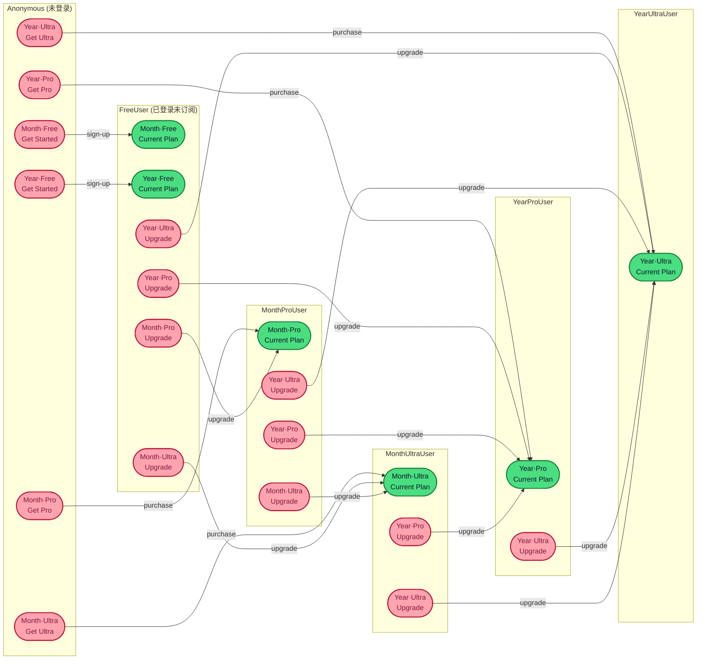

# Money Price 价格卡片：设计与实现理解笔记

## 1. 组件分层总览
- **服务端组件 `money-price.tsx`**：在服务器端构造展示所需的文本与默认价格信息，负责渲染静态 DOM 结构（标题、价格卡骨架、计费切换按钮、按钮占位符等）。
- **客户端组件 `money-price-interactive.tsx`**：挂载在服务端输出的 DOM 之上，注入交互行为（计费周期切换、价格更新、按钮 Portal、工具提示等）以及用户态判断。
- **按钮客户端组件 `money-price-button.tsx`**：独立封装按钮渲染与行为，依据 `UserContext` 与 `billingType` 决定可见性、禁用状态和点击行为。
- **配置与类型**：`money-price-config-util.ts` 提供在当前激活支付供应商下定位价格计划的工具函数；`money-price-types.ts` 定义所有核心类型；业务层配置位于 `apps/ddaas/src/lib/money-price-config.ts`。

## 2. 数据来源与注入流程
1. **国际化文案**：服务端组件通过 `getTranslations` 读取 `moneyPrice` 命名空间，获得标题、副标题、`billingSwitch` (选项与默认键)、各计划的特性列表、按钮文案。
2. **价格配置**：调用 `getActiveProviderConfig(config)` 提取当前支付供应商（默认 `stripe`）的 `products` 配置，也就是 `free/pro/ultra` 下的 `monthly/yearly` 价格数据。
3. **服务端渲染输出**：
   - 根据默认计费周期渲染当前价格、单位、折扣徽标等。
   - 为每个计划渲染 `
` 作为按钮占位符。
   - 渲染带 `data-billing-button` 标记的月付/年付按钮，供客户端挂载事件。
4. **客户端增强**：
   - `MoneyPriceInteractive` 接收服务端传入的 `data`、`config`、`upgradeApiEndpoint` 等参数。
   - 通过指纹上下文 (`useFingerprintContextSafe`) + Clerk 用户信息同步用户登录状态与订阅信息。
   - 根据 `xSubscription.priceId` 与配置匹配当前用户订阅计划，从而产出 `UserState`。
   - 通过 DOM 查询更新价格文本/单位/折扣，利用 Portal 将 `MoneyPriceButton` 渲染到对应占位符。

## 3. 用户态与按钮行为
- `UserState` 枚举包括 `Anonymous`、`FreeUser`、`ProUser`、`UltraUser`。
- `getUserState()`：
  1. 若无指纹上下文或无 Clerk 登录用户 → `Anonymous`。
  2. 若未订阅或订阅非激活 → `FreeUser`。
  3. 通过 `priceId` 与配置中的 `pro` / `ultra` 月付、年付 priceId 对比，判定为 `ProUser` 或 `UltraUser`。
- **付费阶梯（价格从低到高）**：`Free < Month·Pro < Month·Ultra < Year·Pro < Year·Ultra`。升级只允许沿此顺序向上，禁止走回价格更低的组合。
- `MoneyPriceButton` 根据 `UserContext` 渲染：
  - Anonymous：六张卡统一显示 Get Started / Get Pro / Get Ultra。
  - FreeUser：Month·Free 与 Year·Free → Current Plan；其余四张卡 → Upgrade。
  - ProUser (monthly)：Month·Pro → Current Plan；Month·Ultra、Year·Pro、Year·Ultra → Upgrade；两张 Free 隐藏（价格更低）。
  - ProUser (yearly)：Year·Pro → Current Plan；Year·Ultra → Upgrade；其它卡片（含 Month·Pro、Month·Ultra、两张 Free）隐藏（价格更低）。
  - UltraUser (monthly)：Month·Ultra → Current Plan；Year·Ultra → Upgrade；其它全部隐藏（价格更低）。
  - UltraUser (yearly)：Year·Ultra → Current Plan；其它五张隐藏（价格更低）。
- `onUpgrade` 请求携带 `priceId/plan/billingType/provider`，默认调用 `upgradeApiEndpoint` (post→`/api/subscriptions/create` 等)。若未提供接口则跳转首页。

### 规则总结

- 整体升级路径：`Free → Month·Pro → Month·Ultra → Year·Pro → Year·Ultra`，任一用户状态下只有当目标卡片位于该序列中更靠后的节点时，按钮才会显示 `Upgrade`。

| 用户状态 | 可见卡片 | 按钮行为 | 隐藏原因 |
| --- | --- | --- | --- |
| Anonymous | 全部 6 张 | Get Started / Get Pro / Get Ultra | – |
| FreeUser | Month·Free、Year·Free → Current Plan Month·Pro、Year·Pro、Month·Ultra、Year·Ultra → Upgrade | – |
| MonthProUser | Month·Pro → Current Plan Month·Ultra、Year·Pro、Year·Ultra → Upgrade | 两张 Free → 隐藏（价格更低） |
| MonthUltraUser | Month·Ultra → Current Plan Year·Pro、Year·Ultra → Upgrade | Month·Pro、两张 Free → 隐藏（价格更低）
| YearProUser | Year·Pro → Current Plan Year·Ultra → Upgrade | Month·Pro、Month·Ultra、两张 Free → 隐藏（价格更低） |
| YearUltraUser | Year·Ultra → Current Plan | 其它五张 → 隐藏（价格更低） |

### 升级流程图

## 4. 计费周期与价格展示逻辑
- **默认值确定**：
  - 服务端：根据翻译配置中的 `billingSwitch.defaultKey`（目前为 `yearly`）渲染初始样式与文案。
  - 客户端：`billingType` state 懒初始化时尝试读取 `fingerprintContext.xSubscription.priceId`，若匹配任一 *年付* priceId 则返回 `yearly`，否则为 `monthly`；若指纹数据尚未就绪则退回 `defaultKey`。
- **按钮外观切换**：
  - 通过 `updateButtonStyles` 手动覆盖 `className` 实现当前按钮高亮（使用 `cn` 拼接 Tailwind 样式）。
  - `useEffect` 安装 `click` 事件监听，将 `setBillingType` 与 `updatePriceDisplay/updateDiscountInfo/updateButtonStyles` 串联在一起。
- **价格/折扣 DOM 更新**：
  - `updatePriceDisplay` 遍历三种 plan，利用 `document.querySelector('[data-price-value="planKey"]')` 逐个更新金额、单位、划线原价与折扣徽标。
  - `updateDiscountInfo` 专门处理卡片顶部的折扣提示区，根据当前计费类型和配置中的 `discountPercent` 判断是否显示徽标。
- **Portal 挂载**：
  - `useEffect` (依赖 `data.plans`、`userContext`、`billingType` 等) 每次重新生成 `ReactDOM.createPortal` 列表，将按钮渲染进对应占位节点。
- **工具提示**：
  - 另一个 `useEffect` 为每个带 tooltip 的特性项注册鼠标事件，更新 `tooltip` state，并在根节点渲染一个浮层。

## 5. 已知问题梳理
- **月付用户默认展示年付按钮**：首屏指纹数据缺失时，客户端无法在初始化阶段识别真实付费周期，导致 `billingType` 落在翻译默认值；服务端渲染又直接给年付按钮加高亮样式。需在指纹数据加载之后重新计算，并驱动受控渲染。
- **DOM 操作较重**：多处直接通过 `querySelector` 修改内容或 class，导致状态来源分散，难以扩展新的计费模式，也不利于 React 渲染一致性。
- **按钮事件手动管理**：计费切换按钮使用原生事件监听，必须在 effect 中清理，存在遗漏风险。
- **subscriptionType 字段未使用**：目前 `userContext.subscriptionType` 始终通过 priceId 文本包含判断，尚未被消费；若未来直接使用，需改为基于配置映射。
- **Portal 依赖 DOM 查询**：按钮挂载依赖 `data-button-placeholder` 查询，不容易在 SSR 或骨架加载场景下做细粒度控制。

## 6. 改进与 OneTime 扩展思路
- **受控状态改造**：将计费切换改为标准 React 组件，直接使用 state 与 props 控制按钮样式、价格展示；服务端可以渲染所有选项，客户端通过状态驱动显示。
- **抽象计费枚举**：在 `MoneyPriceTypes` 定义统一 `BillingCycle` 类型（如 `'monthly' | 'yearly' | 'onetime'`），让 `ProductConfig.plans` 基于映射存储，避免硬编码键。
- **配置向下兼容**：扩展 `apps/ddaas/src/lib/money-price-config.ts` 为每个产品添加 `onetime`，并调整 `getProductPricing` 接口支持任意 key。
- **按钮文案与翻译更新**：在翻译文件中加入 `OneTime` 文案及 `billingSwitch.options` 第三个 entry，确保服务端渲染时即可展示。
- **交互与校验**：升级逻辑需兼容 OneTime，一方面确认是否仍走 checkout API，另一方面决定用户在已有订阅时能否购买一次性方案。
- **工具提示重构**：将 tooltip 渲染为受控组件（如 `useState` + `onMouseEnter` 直接传递 props），削减对 DOM 的显式操作。

## 7. 总结
Money Price 方案在宏观上延续了“服务端骨架 + 客户端增强”的模式，利用配置与类型体系支撑多语言、多支付供应商与多产品层级。当前的主要问题集中在客户端交互层：对 DOM 的直接操控和初始状态推断不够稳健。后续针对 OneTime 扩展以及现有 bug 修复，最好先完成状态与渲染逻辑的受控化改造，从而确保新的计费类型和用户态逻辑能够平滑嵌入。
