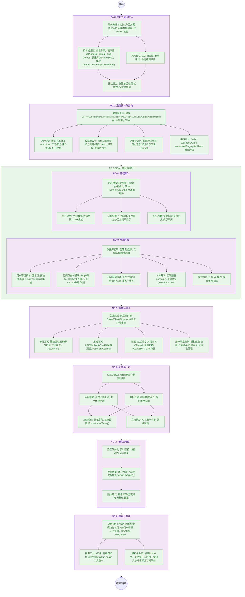

## 订阅与积分系统产研设计文档 v1.0

本文档详细描述了一个与Stripe支付处理集成的订阅与积分系统的全面设计。该系统旨在为用户提供无缝的订阅服务、积分管理和支付体验，确保可扩展性、安全性和可维护性。设计涵盖了用户操作、数据模型、数据流、用户场景和系统时序，确保清晰度、专业性和鲁棒性。

## 1. 系统目标

- 使用户能够通过Stripe订阅计划或购买一次性积分包
- 提供用户友好的界面，用于管理订阅和查看积分余额
- 使用Fingerprint确保用户（包括匿名用户）的安全识别
- 支持灵活的订阅管理（自动续费、取消、升级、附加包）
- 维护详细的交易和积分使用历史记录
- 设计可扩展的数据模型和清晰的数据流，确保可靠性和性能
- 支持匿名用户到注册用户的完整生命周期管理
  
## 2. 里程碑

## 3. 关键考虑

### 3.1 数据隔离
- 匿名用户通过 `user_id` 和 `fingerprint_id` 唯一关联。
- 用户注销软删除

### 3.2 安全性
- **Fingerprint**：通过限制每设备积分分配，防止免费积分滥用。
- **Stripe Webhook**：验证签名以确保真实性。
- **数据隐私**：加密敏感数据（例如，`pay_session_id`）并符合GDPR。
- 使用 `fingerprint_id` 防止匿名用户滥用免费积分。
- 注销时需身份验证（密码或 SSO），防止恶意操作。

### 3.3 可扩展性
- **数据库索引**：优化`user_id`、`fingerprint_id`和`pay_session_id`的查询。
- **缓存加速**：使用Redis缓存活跃用户的 `Credits` 和 `Subscriptions` 数据。
- **异步处理**：异步处理Stripe Webhook，避免用户操作延迟。
- **负载均衡**：使用负载均衡器将流量分配到多个后端服务器。

### 3.4 用户体验
- **清晰提示**：当积分耗尽时，引导匿名用户注册。
- **透明历史记录**：提供详细的交易和使用日志。
- **响应式界面**：确保订阅界面适配移动设备。

## 4.模块设计

|模块|文档链接|
|-----|-----------|
|用户系统|B|
|数据模型|A|
|状态流转|D|
|FingerprintContext|E|
|价格组件|F|
|积分组件|G|
|Webhook组件|J|

## 5. 未来改进
- **多货币支持**：通过Stripe支持多种货币支付。
- **促销积分**：提供限时促销积分用于营销活动。
- **通知**：为低积分余额或订阅变化发送电子邮件/短信提醒。
- **分析仪表板**：为用户提供积分使用模式的洞察。
- **API访问**：提供API供开发者集成订阅系统（参考 https://x.ai/api）。

## 参考

- Stripe文档：https://stripe.com/docs
- Stripe Webhook文档：https://stripe.com/docs/webhooks
- Fingerprint文档：https://fingerprint.com/docs
- Mermaid语法：https://mermaid.js.org/syntax/sequenceDiagram.html
- 示例UI灵感：https://pikttochart.com/generative-ai/editor/ 

