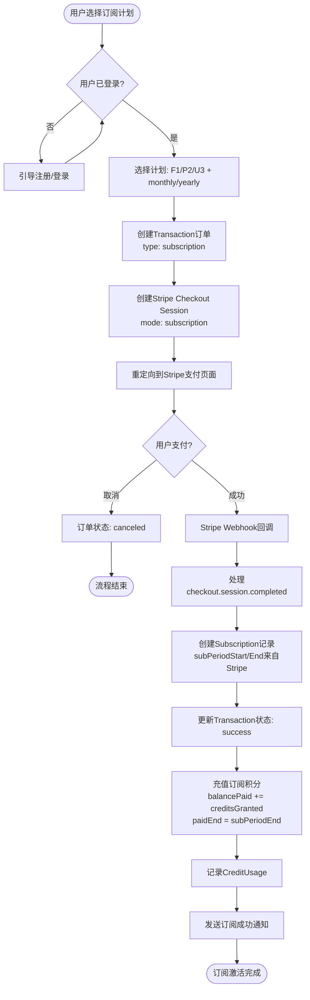
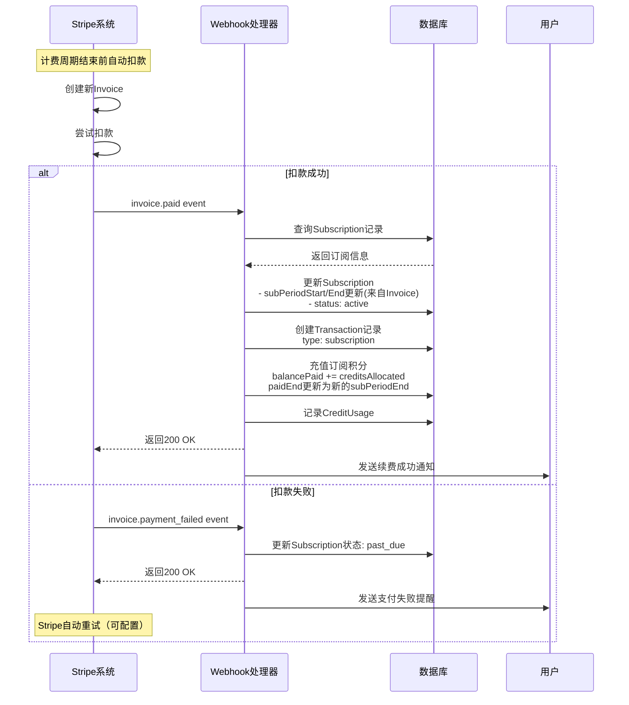
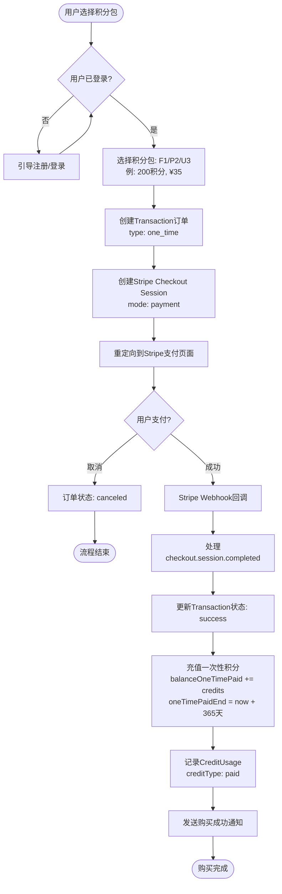
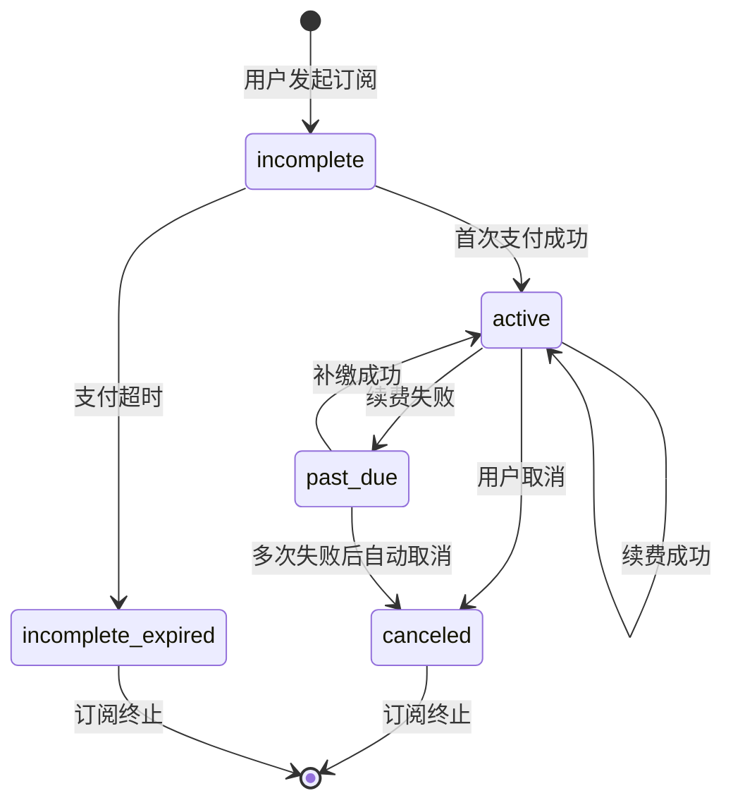
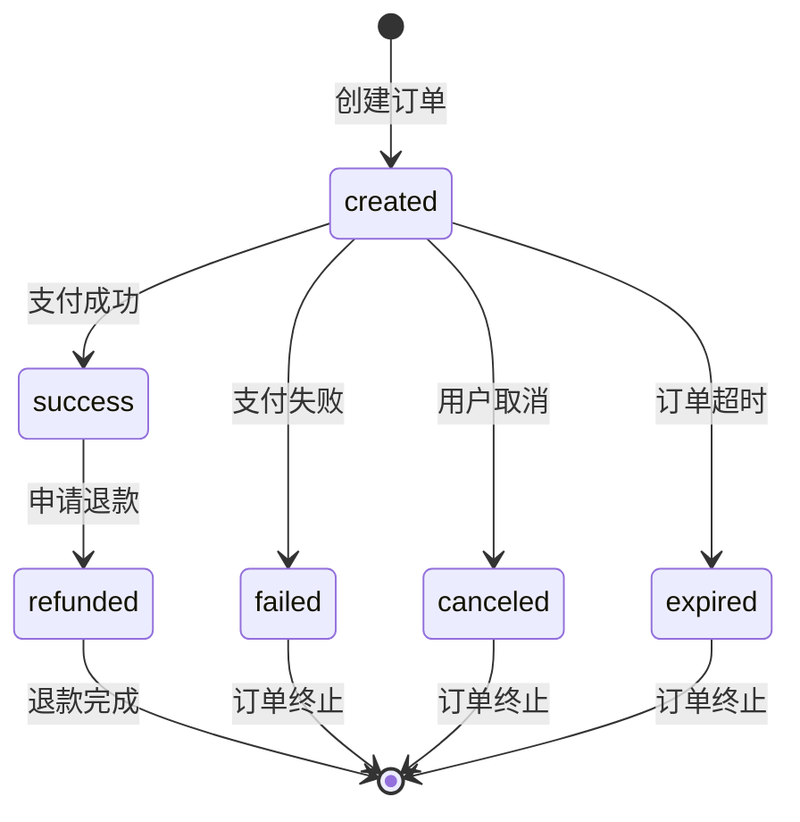

# Part 3: 支付流程与业务逻辑

## 1. 核心流程概览

### 1.1 流程分类
```
支付流程体系
├── 订阅流程 (Subscription)
│   ├── 首次订阅
│   ├── 订阅续费（自动/手动）
│   ├── 订阅升级/降级
│   └── 订阅取消
└── 一次性支付流程 (OneTime Payment)
    ├── 积分包购买（无订阅用户）
    └── 积分包购买（有订阅用户）
```

### 1.2 流程统一规范
所有支付流程遵循统一的阶段划分：
```
1. 预检查 → 2. 创建订单(Transaction) → 3. Stripe支付 → 4. Webhook处理 → 5. 业务完成
```

**关键原则**：
- 先创建Transaction订单记录
- 订阅模式：处理Subscription表 + Credit.balancePaid
- 一次性支付：仅处理Credit.balanceOneTimePaid

---

## 2. 订阅流程详解

### 2.1 首次订阅流程

#### 2.1.1 业务流程图


#### 2.1.2 关键计算逻辑
```typescript
// 订阅有效期直接使用Stripe的计费周期
async function handleSubscriptionCheckout(stripeSubscription: Stripe.Subscription) {
  // 从Stripe获取订阅周期
  const subPeriodStart = new Date(stripeSubscription.current_period_start * 1000);
  const subPeriodEnd = new Date(stripeSubscription.current_period_end * 1000);

  // 订阅积分有效期与订阅周期完全一致
  const paidStart = subPeriodStart;
  const paidEnd = subPeriodEnd;

  return {
    subPeriodStart,
    subPeriodEnd,
    paidStart,   // Credit表的订阅积分有效期开始
    paidEnd      // Credit表的订阅积分有效期结束
  };
}

// 示例输出（月付）
// subPeriodStart: 2025-01-15 10:30:00
// subPeriodEnd:   2025-02-15 10:30:00
// paidStart:      2025-01-15 10:30:00
// paidEnd:        2025-02-15 10:30:00

// 示例输出（年付）
// subPeriodStart: 2025-01-15 10:30:00
// subPeriodEnd:   2026-01-15 10:30:00
// paidStart:      2025-01-15 10:30:00
// paidEnd:        2026-01-15 10:30:00
```

#### 2.1.3 数据流转示例
```
用户操作:
  - 选择 Pro Plan (Monthly, ¥140/月, 250积分)

1. Transaction表创建:
   - orderId: "order_abc123"
   - type: "subscription"
   - priceId: "price_pro_monthly"
   - amount: 140.00
   - creditsGranted: 250
   - orderStatus: "created"

2. Stripe Checkout:
   - sessionId: "cs_test_xyz456"
   - mode: "subscription"
   - line_items: [{ price: "price_pro_monthly", quantity: 1 }]

3. Webhook处理 (checkout.session.completed):
   a) 创建Subscription记录:
      - paySubscriptionId: "sub_1234abcd"
      - priceId: "price_pro_monthly"
      - status: "active"
      - subPeriodStart: 2025-01-15 10:30:00 (来自Stripe)
      - subPeriodEnd: 2025-02-15 10:30:00 (来自Stripe)
      - creditsAllocated: 250

   b) 更新Transaction:
      - orderStatus: "success"
      - paySubscriptionId: "sub_1234abcd"
      - paidAt: 2025-01-15 10:32:00

   c) 更新Credit表（订阅积分）:
      - balancePaid: +250
      - totalPaidLimit: +250
      - paidStart: 2025-01-15 10:30:00  ← 与订阅周期一致
      - paidEnd: 2025-02-15 10:30:00    ← 与订阅周期一致

   d) 创建CreditUsage:
      - operationType: "recharge"
      - creditType: "paid"
      - creditsUsed: 250
      - orderId: "order_abc123"
```

---

### 2.2 订阅续费流程

#### 2.2.1 自动续费流程图


#### 2.2.2 关键业务规则
```typescript
// 续费时的订阅积分有效期处理
async function renewSubscription(subscriptionId: string, invoice: Stripe.Invoice) {
  const subscription = await getSubscription(subscriptionId);

  // 从Invoice获取新的计费周期
  const newSubPeriodStart = new Date(invoice.period_start * 1000);
  const newSubPeriodEnd = new Date(invoice.period_end * 1000);

  return await prisma.$transaction(async (tx) => {
    // 1. 更新Subscription记录
    await tx.subscription.update({
      where: { id: subscription.id },
      data: {
        status: 'active',
        subPeriodStart: newSubPeriodStart,
        subPeriodEnd: newSubPeriodEnd,
        updatedAt: new Date()
      }
    });

    // 2. 充值订阅积分并更新有效期
    await tx.credit.update({
      where: { userId: subscription.userId },
      data: {
        balancePaid: { increment: subscription.creditsAllocated },
        totalPaidLimit: { increment: subscription.creditsAllocated },
        paidStart: newSubPeriodStart,  // ✅ 更新为新周期开始
        paidEnd: newSubPeriodEnd        // ✅ 更新为新周期结束
      }
    });

    // 3. 创建续费Transaction记录
    const renewalOrderId = `order_renew_${nanoid(16)}`;
    await tx.transaction.create({
      data: {
        userId: subscription.userId,
        orderId: renewalOrderId,
        orderStatus: 'success',
        type: 'subscription',
        paySubscriptionId: subscription.paySubscriptionId,
        payInvoiceId: invoice.id,
        creditsGranted: subscription.creditsAllocated,
        subPeriodStart: newSubPeriodStart,
        subPeriodEnd: newSubPeriodEnd,
        paidAt: new Date(invoice.created * 1000),
      }
    });

    // 4. 记录CreditUsage
    await tx.creditUsage.create({
      data: {
        userId: subscription.userId,
        feature: 'subscription_renewal',
        orderId: renewalOrderId,
        creditType: 'paid',
        operationType: 'recharge',
        creditsUsed: subscription.creditsAllocated,
      }
    });
  });
}
```

**关键点**：
- ✅ 订阅积分有效期（paidEnd）自动延长到新的subPeriodEnd
- ✅ 无需手动计算366天，完全由Stripe管理
- ✅ 月付用户：每月自动续费，paidEnd延长1个月
- ✅ 年付用户：每年自动续费，paidEnd延长1年

---

### 2.3 订阅升级/降级流程

#### 2.3.1 升级流程（立即生效）
```typescript
async function upgradeSubscription(params: {
  userId: string;
  currentPriceId: string;
  newPriceId: string;
  newCreditsAllocated: number;
}) {
  // 1. 调用Stripe API更新订阅
  const stripeSubscription = await stripe.subscriptions.update(
    params.currentSubscriptionId,
    {
      items: [{
        id: params.subscriptionItemId,
        price: params.newPriceId
      }],
      proration_behavior: 'create_prorations', // 按比例计费
    }
  );

  // 2. Webhook会收到customer.subscription.updated事件
  // 在Webhook中处理后续逻辑
}

// Webhook处理升级
async function handleSubscriptionUpgrade(stripeSubscription: Stripe.Subscription) {
  return await prisma.$transaction(async (tx) => {
    // 1. 更新Subscription记录
    await tx.subscription.update({
      where: { paySubscriptionId: stripeSubscription.id },
      data: {
        priceId: stripeSubscription.items.data[0].price.id,
        creditsAllocated: getCreditsForPrice(stripeSubscription.items.data[0].price.id),
        subPeriodStart: new Date(stripeSubscription.current_period_start * 1000),
        subPeriodEnd: new Date(stripeSubscription.current_period_end * 1000),
      }
    });

    // 2. 立即补差额积分（可选）
    const creditDiff = newCreditsAllocated - oldCreditsAllocated;
    if (creditDiff > 0) {
      await tx.credit.update({
        where: { userId: subscription.userId },
        data: {
          balancePaid: { increment: creditDiff },
          totalPaidLimit: { increment: creditDiff },
          // 有效期保持不变，使用现有的subPeriodEnd
        }
      });
    }
  });
}
```

#### 2.3.2 降级流程（周期末生效）
```typescript
async function downgradeSubscription(params: {
  currentSubscriptionId: string;
  newPriceId: string;
}) {
  // 设置在当前周期结束时降级
  const stripeSubscription = await stripe.subscriptions.update(
    params.currentSubscriptionId,
    {
      items: [{
        id: params.subscriptionItemId,
        price: params.newPriceId
      }],
      proration_behavior: 'none',  // 不立即计费
      billing_cycle_anchor: 'unchanged'  // 保持计费周期不变
    }
  );

  // Webhook会在周期结束时收到customer.subscription.updated事件
}
```

**推荐策略**：
- 升级：立即生效 + 按比例计费
- 降级：周期末生效，避免退款和积分回收

---

## 3. 一次性支付流程详解

### 3.1 积分包购买流程

#### 3.1.1 业务流程图


#### 3.1.2 关键逻辑
```typescript
// 一次性积分有效期计算
function calculateOneTimeCreditExpiry() {
  const now = new Date();
  const oneTimePaidStart = now;
  const oneTimePaidEnd = new Date(now);
  oneTimePaidEnd.setDate(oneTimePaidEnd.getDate() + 365);  // 1年有效期
  oneTimePaidEnd.setHours(23, 59, 59, 999);

  return { oneTimePaidStart, oneTimePaidEnd };
}

// 示例输出
// oneTimePaidStart: 2025-01-15 14:20:00
// oneTimePaidEnd:   2026-01-15 23:59:59
```

#### 3.1.3 数据流转示例
```
用户操作:
  - 选择积分包 P2 (200积分, ¥35)

1. Transaction表创建:
   - orderId: "order_def456"
   - type: "one_time"  ← 关键
   - priceId: "price_credits_p2"
   - amount: 35.00
   - creditsGranted: 200
   - orderStatus: "created"
   - paySubscriptionId: null  ← 一次性支付无订阅ID

2. Stripe Checkout:
   - sessionId: "cs_test_oneTime789"
   - mode: "payment"  ← 关键：payment模式
   - line_items: [{ price: "price_credits_p2", quantity: 1 }]

3. Webhook处理 (checkout.session.completed):
   a) 更新Transaction:
      - orderStatus: "success"
      - paySessionId: "cs_test_oneTime789"
      - paidAt: 2025-01-15 14:20:00

   b) 更新Credit表（一次性购买积分）:
      - balanceOneTimePaid: +200  ← 注意：不是balancePaid
      - totalOneTimePaidLimit: +200
      - oneTimePaidStart: 2025-01-15 14:20:00
      - oneTimePaidEnd: 2026-01-15 23:59:59  ← 1年有效期

   c) 创建CreditUsage:
      - operationType: "recharge"
      - creditType: "paid"  ← 虽然是paid，但实际充值的是oneTimePaid
      - creditsUsed: 200
      - orderId: "order_def456"

   d) ❌ 不创建Subscription记录
   e) ❌ 不影响订阅状态
```

---

### 3.2 积分包购买流程（有订阅用户）

#### 3.2.1 业务规则
```
前提条件: 用户已有有效订阅（subscription.status = 'active'）
购买流程: 与无订阅用户完全相同
区别:
  1. ✅ 用户已有会员身份，体验更流畅
  2. ✅ 购买积分包不影响订阅状态
  3. ✅ 购买积分包不延长订阅有效期
  4. ✅ 两种积分独立管理：
     - balancePaid（订阅积分）← 订阅续费时充值
     - balanceOneTimePaid（一次性积分）← 积分包购买时充值
```

#### 3.2.2 场景示例
```
用户状态:
  - 订阅: Ultra Yearly
    * subPeriodEnd: 2026-01-15 10:30:00
    * balancePaid: 500
    * paidEnd: 2026-01-15 10:30:00

  - 积分余额:
    * balancePaid: 500 (订阅积分)
    * balanceOneTimePaid: 0 (一次性积分)

用户操作:
  - 购买积分包 U3 (1000积分, ¥88)

系统处理:
  1. 验证用户已登录 ✅
  2. 创建订单 (type: one_time, creditsGranted: 1000)
  3. Stripe支付成功
  4. 充值一次性积分:
     - balanceOneTimePaid: 0 + 1000 = 1000
     - oneTimePaidEnd: 2026-01-15 23:59:59 (购买时间+1年)
  5. 订阅状态: 完全不变
     - subPeriodEnd: 仍为 2026-01-15 10:30:00
     - balancePaid: 仍为 500

结果:
  - 用户现在拥有:
    * 订阅积分: 500 (有效期至 2026-01-15 10:30:00)
    * 一次性积分: 1000 (有效期至 2026-01-15 23:59:59)
    * 总可用积分: 1500
  - 两种积分有效期独立管理
```

---

## 4. 积分充值与消耗逻辑

### 4.1 积分充值规则

#### 4.1.1 充值来源分类
```
免费积分充值:
  - 来源: 新用户注册、活动赠送、系统补偿
  - 字段: balanceFree
  - 有效期: freeStart/freeEnd (通常30天)
  - CreditUsage.creditType = "free"

订阅积分充值:
  - 来源: 订阅支付、订阅续费
  - 字段: balancePaid
  - 有效期: paidStart/paidEnd (与订阅周期一致)
  - CreditUsage.creditType = "paid"
  - 关联: 必须有Transaction记录 (type: subscription)

一次性积分充值:
  - 来源: 积分包购买
  - 字段: balanceOneTimePaid
  - 有效期: oneTimePaidStart/oneTimePaidEnd (购买后1年)
  - CreditUsage.creditType = "paid"
  - 关联: 必须有Transaction记录 (type: one_time)
```

#### 4.1.2 充值流程统一处理
```typescript
// 订阅积分充值
async function rechargeSubscriptionCredits(params: {
  userId: string;
  amount: number;
  orderId: string;
  subPeriodStart: Date;
  subPeriodEnd: Date;
}) {
  return await prisma.$transaction(async (tx) => {
    await tx.credit.update({
      where: { userId: params.userId },
      data: {
        balancePaid: { increment: params.amount },
        totalPaidLimit: { increment: params.amount },
        paidStart: params.subPeriodStart,  // ✅ 与订阅周期一致
        paidEnd: params.subPeriodEnd
      }
    });

    await tx.creditUsage.create({
      data: {
        userId: params.userId,
        feature: 'subscription',
        orderId: params.orderId,
        creditType: 'paid',
        operationType: 'recharge',
        creditsUsed: params.amount
      }
    });
  });
}

// 一次性积分充值
async function rechargeOneTimeCredits(params: {
  userId: string;
  amount: number;
  orderId: string;
}) {
  const { oneTimePaidStart, oneTimePaidEnd } = calculateOneTimeCreditExpiry();

  return await prisma.$transaction(async (tx) => {
    await tx.credit.update({
      where: { userId: params.userId },
      data: {
        balanceOneTimePaid: { increment: params.amount },
        totalOneTimePaidLimit: { increment: params.amount },
        oneTimePaidStart,  // ✅ 购买时间
        oneTimePaidEnd     // ✅ 购买时间 + 1年
      }
    });

    await tx.creditUsage.create({
      data: {
        userId: params.userId,
        feature: 'credit_pack',
        orderId: params.orderId,
        creditType: 'paid',
        operationType: 'recharge',
        creditsUsed: params.amount
      }
    });
  });
}
```

---

### 4.2 积分消耗规则

#### 4.2.1 消耗优先级
```
消耗顺序:
1. 免费积分优先 (balanceFree)
2. 订阅积分补足 (balancePaid)
3. 一次性积分最后 (balanceOneTimePaid)
```

#### 4.2.2 消耗流程
```typescript
async function consumeCredits(params: {
  userId: string;
  amount: number;
  feature: string;
}) {
  const credit = await prisma.credit.findUnique({
    where: { userId: params.userId }
  });

  if (!credit) throw new Error('Credit record not found');

  const totalAvailable =
    credit.balanceFree + credit.balancePaid + credit.balanceOneTimePaid;

  if (totalAvailable < params.amount) {
    throw new Error('Insufficient credits');
  }

  return await prisma.$transaction(async (tx) => {
    let remaining = params.amount;
    const usageRecords = [];

    // 1. 优先消耗免费积分
    if (credit.balanceFree > 0 && remaining > 0) {
      const toConsume = Math.min(credit.balanceFree, remaining);
      await tx.credit.update({
        where: { userId: params.userId },
        data: { balanceFree: { decrement: toConsume } }
      });

      usageRecords.push({
        userId: params.userId,
        feature: params.feature,
        creditType: 'free',
        operationType: 'consume',
        creditsUsed: toConsume
      });

      remaining -= toConsume;
    }

    // 2. 消耗订阅积分
    if (credit.balancePaid > 0 && remaining > 0) {
      const toConsume = Math.min(credit.balancePaid, remaining);
      await tx.credit.update({
        where: { userId: params.userId },
        data: { balancePaid: { decrement: toConsume } }
      });

      usageRecords.push({
        userId: params.userId,
        feature: params.feature,
        creditType: 'paid',
        operationType: 'consume',
        creditsUsed: toConsume
      });

      remaining -= toConsume;
    }

    // 3. 消耗一次性购买积分
    if (credit.balanceOneTimePaid > 0 && remaining > 0) {
      const toConsume = Math.min(credit.balanceOneTimePaid, remaining);
      await tx.credit.update({
        where: { userId: params.userId },
        data: { balanceOneTimePaid: { decrement: toConsume } }
      });

      usageRecords.push({
        userId: params.userId,
        feature: params.feature,
        creditType: 'paid',  // 注意：仍然记录为paid
        operationType: 'consume',
        creditsUsed: toConsume
      });

      remaining -= toConsume;
    }

    // 4. 批量创建CreditUsage记录
    await tx.creditUsage.createMany({ data: usageRecords });

    return { success: true, consumed: params.amount };
  });
}
```

---

## 5. 订阅取消与退款

### 5.1 订阅取消流程

#### 5.1.1 取消策略
```
策略1: 立即取消 (cancelAtPeriodEnd = false)
  - 订阅立即失效
  - paidEnd设置为当前时间
  - 可能需要按比例退款
  - 订阅积分立即过期

策略2: 周期末取消 (cancelAtPeriodEnd = true) ← 推荐
  - 订阅在当前周期结束时失效
  - 用户可继续使用至subPeriodEnd
  - paidEnd保持不变
  - 无需退款，无需回收积分
```

#### 5.1.2 取消流程代码
```typescript
async function cancelSubscription(params: {
  subscriptionId: string;
  cancelAtPeriodEnd: boolean;
}) {
  // 1. 调用Stripe API
  const stripeSubscription = await stripe.subscriptions.update(
    params.subscriptionId,
    {
      cancel_at_period_end: params.cancelAtPeriodEnd
    }
  );

  // 2. 如果立即取消，更新数据库
  if (!params.cancelAtPeriodEnd) {
    await prisma.$transaction(async (tx) => {
      // 更新Subscription状态
      await tx.subscription.update({
        where: { paySubscriptionId: params.subscriptionId },
        data: {
          status: 'canceled',
          subPeriodEnd: new Date()  // 立即结束
        }
      });

      // 更新订阅积分有效期
      await tx.credit.update({
        where: { userId: subscription.userId },
        data: {
          paidEnd: new Date()  // 订阅积分立即过期
        }
      });
    });
  }

  // 3. 周期末取消会在customer.subscription.deleted事件中处理
}
```

---

### 5.2 退款流程

#### 5.2.1 退款处理
```typescript
async function processRefund(params: {
  transactionId: string;
  amount?: number;
  reason: string;
}) {
  const transaction = await getTransaction(params.transactionId);

  // 1. 调用Stripe退款API
  const refund = await stripe.refunds.create({
    payment_intent: transaction.payTransactionId,
    amount: params.amount ? params.amount * 100 : undefined,
    reason: 'requested_by_customer',
  });

  // 2. 更新数据库
  await prisma.$transaction(async (tx) => {
    // 更新Transaction状态
    await tx.transaction.update({
      where: { orderId: transaction.orderId },
      data: { orderStatus: 'refunded' }
    });

    // 如果是订阅，取消订阅
    if (transaction.type === 'subscription' && transaction.paySubscriptionId) {
      await tx.subscription.update({
        where: { paySubscriptionId: transaction.paySubscriptionId },
        data: { status: 'canceled' }
      });

      // 回收订阅积分
      await tx.credit.update({
        where: { userId: transaction.userId },
        data: {
          balancePaid: { decrement: transaction.creditsGranted || 0 }
        }
      });
    }

    // 如果是一次性支付，回收一次性积分
    if (transaction.type === 'one_time') {
      await tx.credit.update({
        where: { userId: transaction.userId },
        data: {
          balanceOneTimePaid: { decrement: transaction.creditsGranted || 0 }
        }
      });
    }

    // 记录积分回收
    await tx.creditUsage.create({
      data: {
        userId: transaction.userId,
        feature: 'refund',
        orderId: transaction.orderId,
        creditType: 'paid',
        operationType: 'consume',
        creditsUsed: -(transaction.creditsGranted || 0)  // 负数表示回收
      }
    });
  });

  return refund;
}
```

---

## 6. 状态机设计

### 6.1 订阅状态机


### 6.2 订单状态机


---

## 7. 总结

### 7.1 核心流程对比

| 特性 | 订阅流程 | 一次性支付流程 |
|-----|---------|--------------|
| Stripe模式 | subscription | payment |
| Transaction.type | `subscription` | `one_time` |
| 创建Subscription记录 | ✅ 是 | ❌ 否 |
| 积分充值字段 | `balancePaid` | `balanceOneTimePaid` |
| 积分有效期 | `paidEnd` = `subPeriodEnd` | `oneTimePaidEnd` = now + 365天 |
| 自动续费 | ✅ 支持 | ❌ 不支持 |
| 有效期管理 | Stripe自动管理 | 购买时固定1年 |

### 7.2 业务规则总结
1. ✅ **先创建Transaction，再处理业务逻辑**
2. ✅ 订阅积分有效期与订阅周期完全一致（由Stripe管理）
3. ✅ 一次性积分有效期为购买后1年（固定）
4. ✅ 三类积分独立管理，消耗时按优先级扣减
5. ✅ 订阅用户可随时购买积分包，互不影响

### 7.3 下一步
详见 **Part 4: Stripe集成与API设计**，将实现完整的Stripe接口对接和Webhook处理逻辑。
