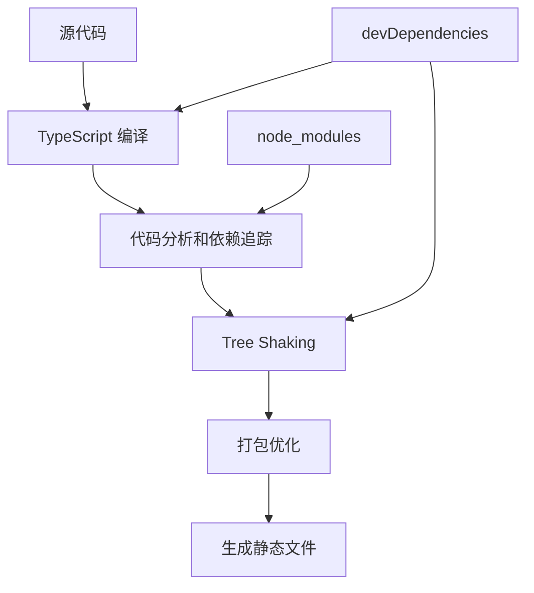
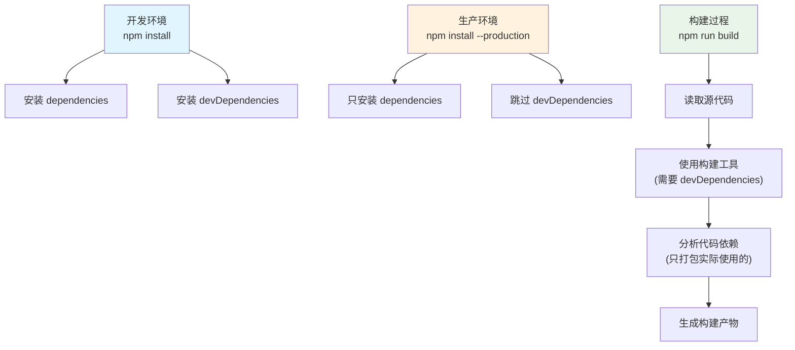

## 🔍 **构建 ≠ 打包！这是关键误解**

### **构建过程的真实流程**

```bash
# Next.js 构建过程
pnpm build
```

**实际发生了什么：**


- 本地与生产环境的差异



## 📋 **详细解析三个阶段**

### **1. 开发环境 (`npm install`)**
```bash
pnpm install  # 安装所有依赖
```
- ✅ **dependencies**: 安装 (React, Next.js 等)
- ✅ **devDependencies**: 安装 (TypeScript, ESLint 等)
- 🎯 **目的**: 提供完整的开发环境

### **2. 生产环境 (`npm install --production`)**
```bash
pnpm install --production  # 只安装运行时依赖
```
- ✅ **dependencies**: 安装
- ❌ **devDependencies**: **不安装**
- 🎯 **目的**: 减少生产服务器的包体积

### **3. 构建过程 (`npm run build`)**
```bash
pnpm build  # 构建代码
```
- 🔧 **使用 devDependencies**: TypeScript 编译器、打包工具
- 🔍 **分析 dependencies**: 找出代码中实际 import 的包
- 📦 **只打包使用的代码**: 不是全量打包

## 🎯 **关键理解：构建 vs 运行**

让我创建一个实际例子来说明：
Ran tool
## 🔑 **核心答案：为什么不会报错？**

### **关键理解：两个不同的环境**

1. **构建环境** (开发机/CI服务器)
   ```bash
   pnpm install          # 安装所有依赖
   pnpm build            # 使用 devDependencies 进行构建
   # 生成: .next/ 文件夹 (静态资源)
   ```

2. **运行环境** (生产服务器)
   ```bash
   pnpm install --production  # 只安装 dependencies
   pnpm start                # 运行构建产物
   # 运行: .next/ 文件夹中的内容
   ```

### **为什么能正常工作？**

**构建产物是自包含的！**

- ✅ **构建时**: TypeScript 将你的代码 + 依赖编译成纯 JavaScript
- ✅ **运行时**: 只需要 Node.js 运行这些 JavaScript 文件
- ✅ **不再需要**: 原始的 TypeScript 编译器、打包工具等

### **类比理解**

```
源代码 + devDependencies → [构建过程] → 可执行程序

就像：
C++ 源码 + 编译器 → [编译] → .exe 文件

运行 .exe 文件时，不需要再安装 Visual Studio！
```

## 📊 **实际验证**

你可以在项目中验证：

```bash
# 1. 正常构建
pnpm build

# 2. 删除 devDependencies
rm -rf node_modules
pnpm install --production

# 3. 尝试运行构建产物
pnpm start  # ✅ 仍然可以正常运行!

# 4. 尝试重新构建
pnpm build  # ❌ 会报错，因为缺少 TypeScript 等工具
```

这就解释了为什么生产环境可以不安装 devDependencies 却不会报错！